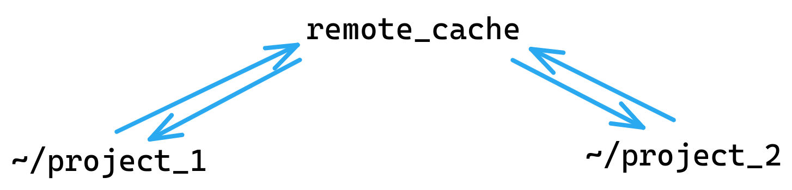
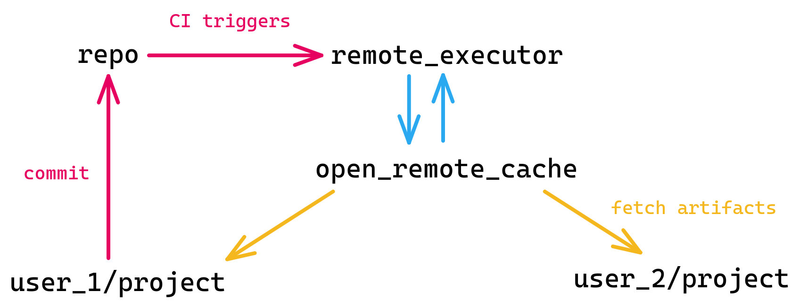

<!-- vale alex.ProfanityUnlikely = NO -->
# Remote caching and execution

`rules_ll` uses remote execution compatible toolchains by default, even when you
run local builds.

`rules_ll` extends [Local Remote Execution (LRE)](https://github.com/TraceMachina/nativelink/tree/main/local-remote-execution)
which disables Bazel's toolchain auto detection and pins every tool to a
reproducible artifact from `nixpkgs`. This way every system running the same
version of `rules_ll` uses the same toolchain, regardless of the host's
operating system and locally installed toolchains.

Similar to LRE, the remote execution toolchains in `rules_ll` achieve virtually
perfect cache hit rates even among different systems sharing the same cache.

<!-- markdownlint-disable code-block-style -->
!!! warning

    A single compromised machine with write access to a remote cache can easily
    trigger malicious code execution on all machines reading from that cache.
<!-- markdownlint-enable code-block-style -->

## Local remote cache

If you just want to share build results between different directories on the
same machine, use a local remote cache. Consider using *at least* this setup
with `rules_ll`. The initial build of the LLVM project can take a long time
and you probably don't want to rebuild LLVM every time you start a new project.

{ loading=lazy }

1. Set up a remote cache like [NativeLink](https://github.com/TraceMachina/nativelink).
2. Instruct all your local Bazel invocations to use that cache:

    ```bash title="~/.bazelrc"
    build --remote_cache=grpc://<ip>:<port>
    ```

## Personal remote cache

If you find yourself running out of disk space, you can move your personal cache
to a different machine such as a cloud runner. Since you now access the remote
cache via the internet this setup requires some form of authentication:

{ loading=lazy }

```bash title="~/.bazelrc"
build --remote_cache=grpcs://<remote_cache>

# Authenticate as instructed by your remote cache provider. For instance
build --remote_header=...
```

## Trusted remote cache

With `rules_ll` you can share the remote cache among different machines of the
same system architecture and still achieve virtually perfect cache hit rate. You
can set this up like the personal remote cache, just shared by different users:

{ loading=lazy }

```bash title="~/.bazelrc"
build --remote_cache=grpcs://<trusted_remote_cache>

# Authenticate as instructed by your remote cache provider.
build --some_authentication_flags
```

## Open remote execution

This setup lets your contributors use cache artifacts from CI runs locally. This
way contributors can fetch prebuilt artifacts from upstream without having to
rebuild the entire project themselves. This works because the toolchain for
local execution reproduces the remote execution environments.

A setup like this lets your contributors use projects the size of LLVM from
upstream in 2 minutes from a clean cache on a laptop. They can download prebuilt
cache artifacts from the CI pipeline instead of having to rebuild the project
themselves.

{ loading=lazy }

1. `user_1` merges a PR.
2. The CI pipeline triggers the build and tests, using a remote executor.
3. The CI runner has write access to the cache so that the remote executor can
   populate the cache during the build.
4. Contributors with read access to the cache can now fetch the latest artifacts
   as part of their build.

```bash title="ci_runner/.bazelrc"
build --remote_cache=grpcs://<open_remote_cache>
build --remote_executor=grpcs://<remote_executor>
build --some_authentication_flag
```

```bash title="contributor/.bazelrc"
build --remote_cache=grpcs://<open_remote_cache>
build --some_authentication_flag_only_read_access
build --noremote_upload_local_results
```
